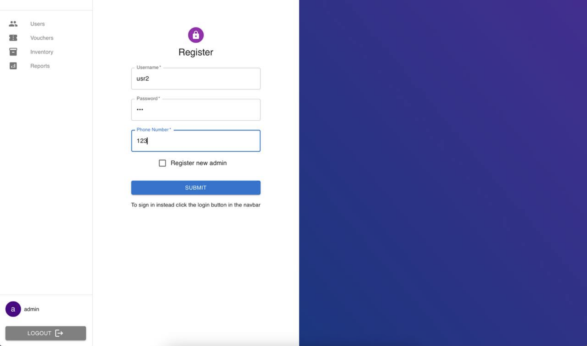
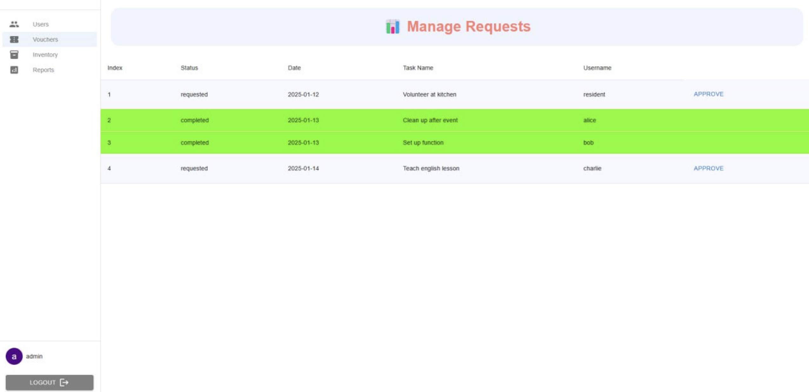
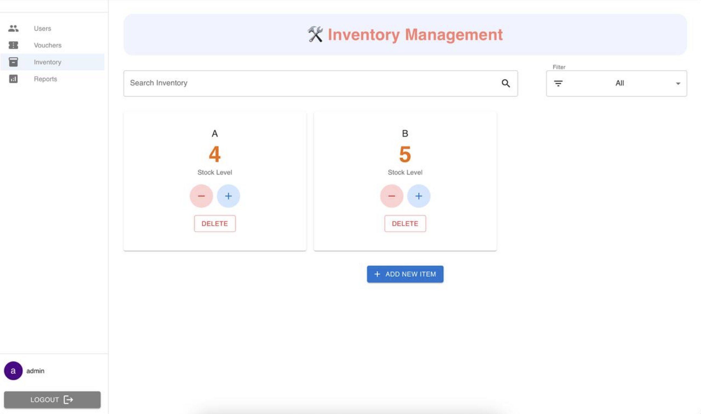
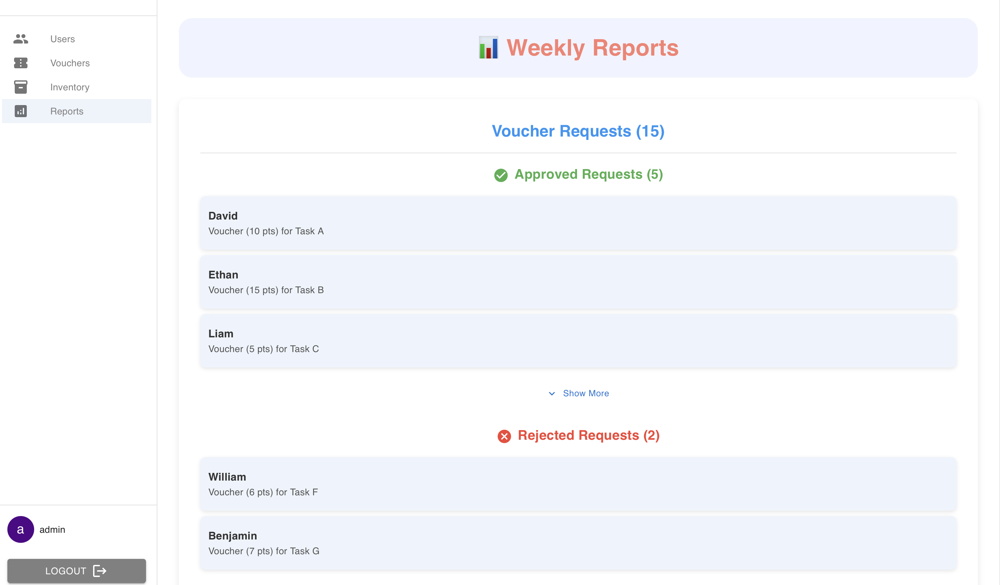

# HACK FOR GOOD 2025

# Minimart and Voucher System for Muhammadiyah Welfare Home

This project is a full-stack web application designed as part of HACK FOR GOOD 2025 to empower residents of Muhammadiyah Welfare Home (MWH) and streamline operations for its staff. The system enables residents to request products, earn vouchers, and manage their accounts while providing robust management and reporting tools for administrators.

## Table of Contents

1. [Target Users](#target-users)
2. [Features](#features)
3. [Tech Stack](#tech-stack)
4. [Installation and Setup](#installation-and-setup)
5. [Usage](#usage)
6. [Project Structure](#project-structure)
7. [Future Enhancements](#future-enhancements)
8. [Contributing](#contributing)
9. [License](#license)

---

## Target Users

### **Residents**

Boys between the ages of 10 and 19 years old who are residents of Muhammadiyah Welfare Home (MWH).

### **Admins**

Members of the Welfare Home such as teachers, welfare officers or part time staff who take care of the boys.

## Features

### **For Residents**

- **Dashboard**: View voucher balances, transaction history, and available products.
- **Request Items**: Request products from the minimart or place preorders for out-of-stock items.
- **Voucher System**: Earn vouchers through tasks and redeem them for products.
- **Secure Login**: Password-protected login system.

### **For Admins**

- **User Management**: Add, delete, and manage user and admin accounts.
  
  (screenshot of adding new users page)

- **Approve/Reject Requests**: Handle product requests and approvals / rejection of tasks.
  
  (screenshot of voucher management page)

- **Inventory Management**: Maintain inventory with real-time tracking and audit logs.
  
  (screenshot of inventory management page)

- **Reports**: Generate detailed reports such as weekly requests and inventory summaries.
  
  (screenshot of weekly reports pages)

### **Future Features**

- **Wishlist and Notifications**: Add products to a wishlist and receive notifications when they are available.
- **Auction System**: Periodic auctions where residents bid for special items using vouchers.
- **Skill Exchange Program**: Residents earn vouchers by offering peer-to-peer skills.
- **Community Goals**: Collaborative milestones unlock rewards for all residents.

---

## Tech Stack

- **Frontend**: React.js
- **Backend**: Node.js with Express.js
- **Database**: PostgreSQL
- **Authentication**: JSON Web Tokens (JWT) and bcrypt

---

## Installation and Setup

### **Requirements**

- Node.js
- NPM
- Docker
- PostgreSQL

### **Steps**

1. **Clone the Repository**

- Clone the repository using HTTPS or SSH
  Example cloning using SSH

  ```bash
  git clone git@github.com:bbbbcccd/hack4good.git
  cd hack4good
  ```

2.  **Set Up the Backend**

- Enter backend directory

  ```bash
  cd backend
  ```

- Configure environment variables
  Create a `.env` file in the backend directory with the following variables:

  ```env
    EXPRESS_PORT=4000
    PG_PORT=5432
    PG_USER=<<YOUR_POSTGRES_USERNAME>>
    PG_PASSWORD=<<YOUR_POSTGRES_PASSWORD>>
    PG_DATABASE=<<YOUR_POSTGRES_DATABASE_NAME>>
    CLIENT_URL=http://localhost:5173
    JWT_SECRET=<<YOUR_JWT_SECRET_KEY>>
  ```

- Build and start docker container

  ```bash
  docker compose down
  docker compose build
  docker compose up
  ```

3.  **Set Up the Frontend**

- Enter frontend directory and install dependencies

  ```bash
  cd ../frontend
  npm install
  ```

- Start the React development server:

  ```bash
  npm run dev
  ```

4. ** Use the web application**

- Use the default admin account with the following credentials to create new user accounts and test features

  ```bash
  username: admin
  password: 123
  ```

---

## Usage

### **Residents**

- Log in using your credentials.
- View your voucher balance and available products.
- Submit requests or preorder out-of-stock items.

### **Admins**

- Log in to access the admin panel.
- Manage residents, inventory, and requests.
- Generate reports to monitor system usage and inventory levels.

---

## Project Structure

Below is a brief overview of the project structure.

```
project-root/
├── backend/
│ ├── database/ # database config
│ ├── controllers/
│ ├── middlewares/
│ ├── routes/
│ ├── docker-compose.yaml # Docker config for backend
│ ├── Dockerfile
│ ├── app.js # Main backend application
│ ├── server.js
│ └── package.json # Backend dependencies
├── frontend/
│ ├── public/
│ │ └── index.html # React entry point
│ ├── src/
│ │ ├── components/
│ │ ├── context/
│ │ ├── hooks/
│ │ ├── pages/
│ │ ├── util/
│ │ ├── App.jsx
│ │ ├── index.css
│ │ ├── App.jsx
│ │ ├── main.jsx
│ │ └── App.css
│ └── package.json # Frontend dependencies
└── README.md
```

---

## Future Enhancements

1. **Mobile App**: Provide mobile access for residents and admins.
2. **Integration with Education**: Tie the system to educational goals where residents can earn vouchers through progress in school subjects or life skills.
